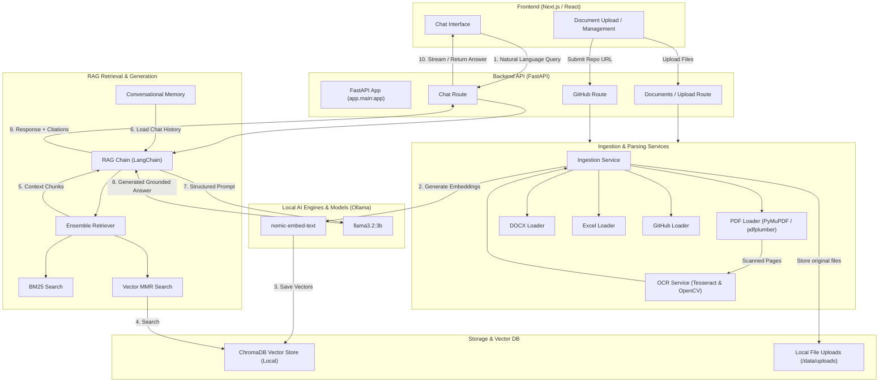

# ONGC Enterprise AI Knowledge Copilot

The ONGC Enterprise AI Knowledge Copilot is a state-of-the-art Retrieval-Augmented Generation (RAG) system built to help ONGC personnel securely interact with massive enterprise documents. It allows users to upload, manage, and query a variety of complex documents, providing highly accurate, cited answers powered by Large Language Models.

## Why Use This Instead of ChatGPT?

For enterprise environments like ONGC, data sensitivity is paramount. Uploading proprietary engineering diagrams, confidential exploration reports, and internal policy documents to public AI models like ChatGPT exposes the organization to severe data privacy risks and potential compliance breaches. 

**This Knowledge Copilot is designed specifically to solve this problem:**

- **100% Data Privacy & Security**: Your documents never leave the organization. The entire pipeline—from document parsing to the Large Language Model (powered locally via Ollama)—runs entirely on internal infrastructure. It can even be deployed in air-gapped environments with no internet access.
- **Zero Data Training Exposure**: Unlike public models that may use your prompts to train future iterations, your sensitive queries and uploaded data remain completely private and isolated.
- **Eliminates Hallucinations**: Standard LLMs often guess or make up facts when they don't know the answer. This system uses strict **Retrieval-Augmented Generation (RAG)**. It only answers based on the exact documents you upload. If the answer isn't in your documents, the system will explicitly state that it doesn't know, rather than guessing.
- **Verifiable Citations**: Every single answer generated by the Copilot includes a direct citation to the source file, allowing engineers and analysts to immediately verify the information against the original document.

## The Need

In large enterprises like ONGC, institutional knowledge is often locked within massive 500-1000+ page PDF reports, engineering manuals, spreadsheets, and scanned documents. Finding specific information is time-consuming and inefficient. The Knowledge Copilot solves this by ingesting these massive documents, breaking them down into semantic chunks, and utilizing AI to answer natural language questions directly based on the uploaded knowledge base.

## Comprehensive Features

- **Enterprise Document Ingestion Pipeline**: A highly advanced, memory-efficient, streaming architecture capable of processing 1000+ page PDFs incrementally without crashing or causing memory bloat.
- **Intelligent Mixed Content Parsing**: 
  - Extracts raw digital text directly using PyMuPDF.
  - Automatically detects scanned pages and falls back to OCR (using Tesseract & OpenCV).
  - Actively detects embedded images within PDFs, extracts them, runs OCR, and injects the text back into the context.
  - Extracts complex tables using `pdfplumber` and structures them into highly readable key-value pairs so the AI can understand tabular data.
- **Fault-Tolerant Processing**: If a single page in a massive document is corrupted, the system logs the error and continues processing the rest of the document seamlessly.
- **Rich Document Metadata**: Extracts and tags documents with metadata (Domain, Department, Document Type) to enable highly filtered and precise semantic searches.
- **Document Management UI**: Drag-and-drop multiple files at once. A dynamic sidebar lists all active documents in the knowledge base, allowing for easy one-click removal and instant index syncing.
- **Conversational Memory**: The chat interface remembers the context of the conversation, allowing for natural follow-up questions.
- **Multi-Format Support**: Natively processes PDFs, DOCX, Excel spreadsheets, raw Images (PNG/JPG), and **Public GitHub Repositories** (clones and indexes source code).
- **Premium ONGC-Branded Interface**: A modern, sleek Next.js App Router frontend customized with ONGC's deep maroon and gold brand colors, utilizing glassmorphism and micro-animations for a premium feel.

## Architecture Diagram



## How It Works (The Full Flow)

### 1. Ingestion Pipeline
- **Upload & Intake**: Users upload documents (PDF, DOCX, Excel, Images) via drag-and-drop or provide a public **GitHub repository URL**.
- **Specialized Loaders**: Files are routed to specific loaders. For massive PDFs, pages are streamed one-by-one to prevent memory overload. GitHub repositories are cloned, and relevant code files (Python, TS/JS, Go, Java, etc.) are extracted.
- **Intelligent Chunking**: Text and code are broken down into semantic chunks. Code files utilize language-specific splitters to respect function and class boundaries.
- **OCR & Data Extraction**: For scanned pages and images, Tesseract-OCR and OpenCV are used. Tables are parsed and converted to key-value pairs.
- **Embedding & Storage**: Chunks are embedded using a local embedding model (e.g., `nomic-embed-text`) and stored in a persistent **ChromaDB** vector database along with rich metadata (document ID, filename, repository name, chunk index).

### 2. Retrieval & Chat Pipeline
- **Querying**: The user asks a natural language question in the chat interface.
- **Hybrid Search**: The question is embedded, and the system performs a search against the vector database (semantic search) and BM25 (keyword search) to retrieve the most relevant chunks across all indexed documents and repositories.
- **Contextual Generation**: The retrieved chunks and conversation history are combined into a strict prompt. The prompt is sent to a local Large Language Model (e.g., `llama3.2:3b` via Ollama).
- **Grounded Answer**: The LLM generates a concise, accurate answer strictly constrained to the provided context.
- **Citations**: The frontend displays the answer alongside direct citations indicating exactly which document, page, or GitHub file the information was sourced from.

## Tech Stack

**Frontend**
- Next.js (App Router), React, TypeScript
- Tailwind CSS (Styling), Framer Motion (Animations)
- Lucide React (Icons)

**Backend**
- Python, FastAPI (REST API)
- LangChain (RAG orchestration, Prompting)
- GitPython (Repository cloning)

**AI & Machine Learning**
- Ollama (Local model execution)
- LLM: `llama3.2:3b` (default for generation)
- Embeddings: `nomic-embed-text` (default for vectorization)

**Database & Storage**
- ChromaDB (Persistent local vector database)

**Document Processing Engine**
- PyMuPDF (`fitz`), pdfplumber (PDFs and tables)
- OpenCV, Tesseract-OCR (Image processing and OCR)
- `python-docx`, `openpyxl` (Office documents)

## Project Structure

The project is cleanly divided into a frontend and a backend repository:

```text
ONGC-RAGAssistant/
│
├── backend/                  # FastAPI & LangChain Backend
│   ├── app/
│   │   ├── api/routes/       # REST API endpoints (chat, upload, documents)
│   │   ├── core/             # Configuration, logging, singleton RAGEngine
│   │   ├── loaders/          # Document loaders (PDF streaming, DOCX, Excel)
│   │   ├── models/           # Pydantic models (Document, Page, Chunk)
│   │   ├── rag/              # RAG logic (Vector store, Embeddings, Splitter, Memory)
│   │   ├── services/         # Orchestration (Ingestion, OCR, Image, Table services)
│   │   └── utils/            # Utilities (Image processing, Metadata extraction)
│   ├── data/chroma/          # Persistent local ChromaDB vector store
│   └── requirements.txt      # Python dependencies
│
└── frontend/                 # Next.js UI Frontend
    ├── src/
    │   ├── app/              # Next.js App Router & global layouts
    │   ├── components/       # React components (Sidebar, ChatInterface)
    │   └── services/         # API utilities (api.ts)
    ├── public/               # Static assets
    └── package.json          # Node.js dependencies
```

## Setup & Running Locally

### Backend Setup
1. Navigate to the backend directory: `cd backend`
2. Create and activate a virtual environment:
   - `python -m venv venv`
   - `venv\Scripts\activate` (Windows)
3. Install dependencies: `pip install -r requirements.txt`
4. Ensure Ollama is running locally with the target model (default: `llama3.2:3b`).
5. Ensure Tesseract-OCR is installed on the system path.
6. Start the server: `uvicorn app.main:app --reload`
   - API runs at: `http://127.0.0.1:8000`

### Frontend Setup
1. Navigate to the frontend directory: `cd frontend`
2. Install dependencies: `npm install`
3. Start the development server: `npm run dev`
4. Open your browser to: `http://localhost:3000`

### Running with Docker Compose (Recommended)

1. Make sure you have Docker and Docker Compose installed and running.
2. Copy the environment configuration:
   ```bash
   copy .env.example .env
   ```
   *(For macOS/Linux, use `cp .env.example .env`)*
3. Build and launch both services:
   ```bash
   docker compose up --build -d
   ```
4. Access the frontend UI at `http://localhost:3000` and the backend REST API at `http://localhost:8000`.
5. Check service logs with `docker compose logs -f` and stop services with `docker compose down`.